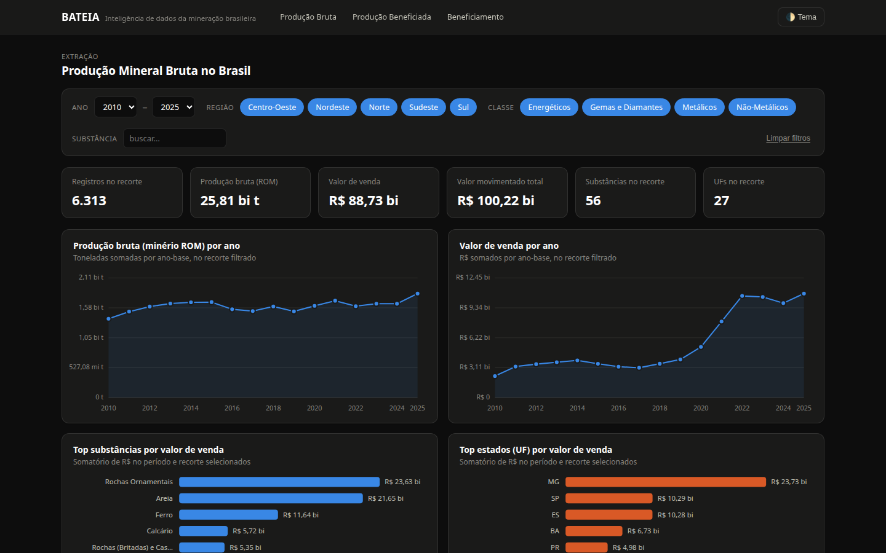
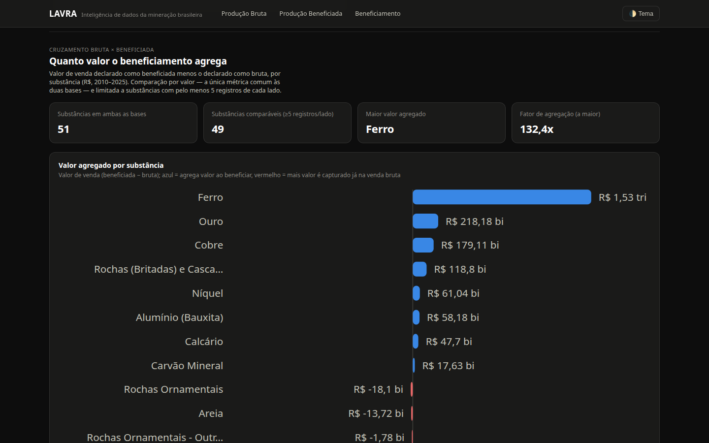
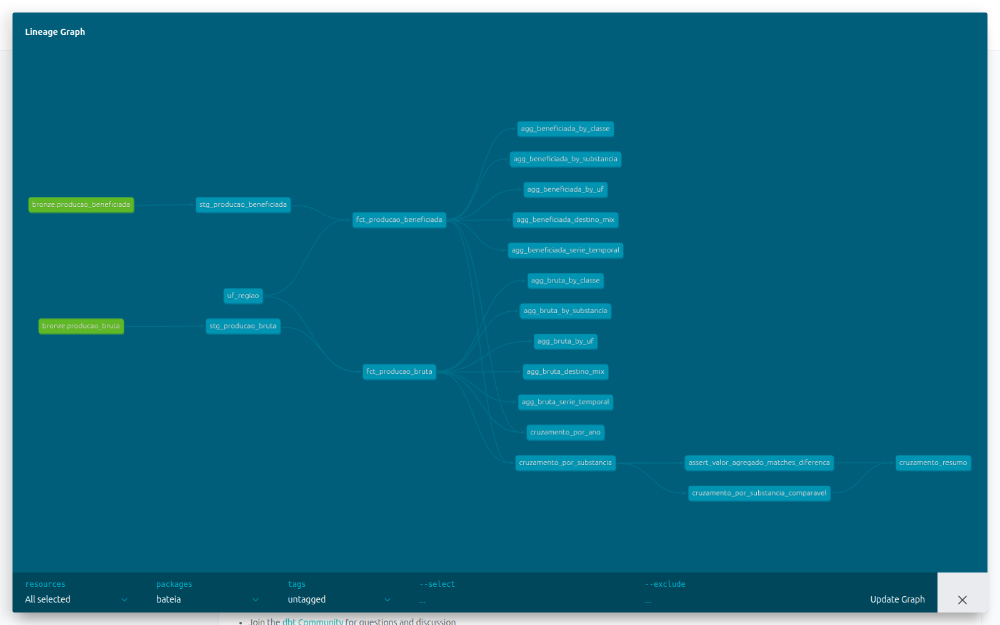
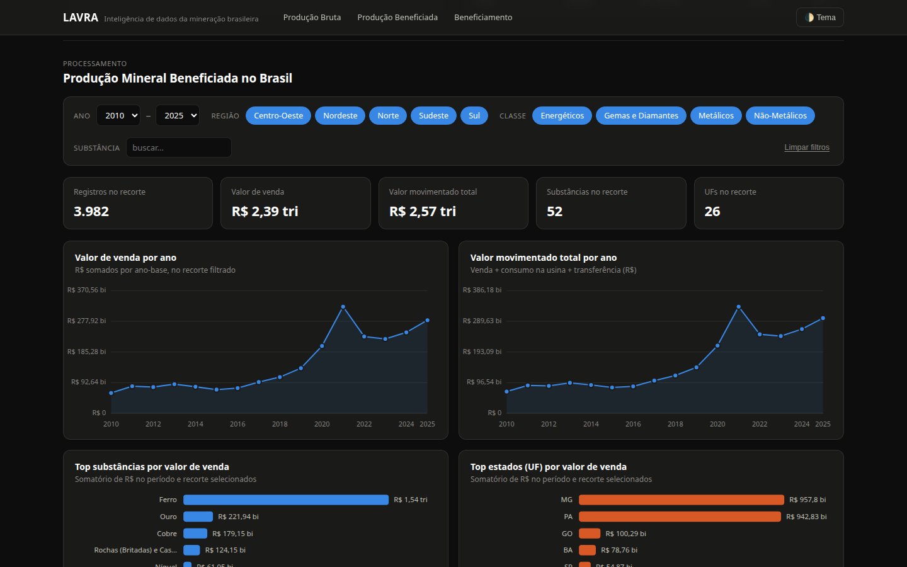
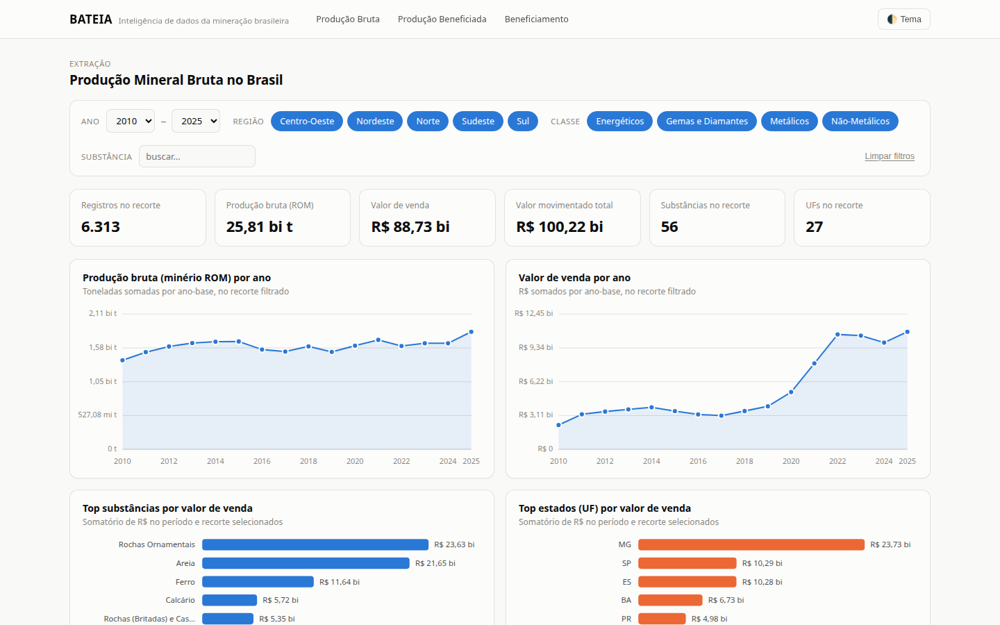

# Bateia

Pipeline de dados de ponta a ponta — extração, transformação em dbt,
cruzamento SQL e dashboard — sobre a mineração brasileira, do dado bruto do
governo ao insight executivo. O nome vem do instrumento usado para separar
mineral valioso do sedimento: é o que o pipeline faz com dados
declaratórios barulhentos.

**[→ Ver o dashboard](output/dashboard.html)** (arquivo HTML único, sem
dependências externas — abre offline, direto do disco). **[→ Ver a
documentação dbt](docs/dbt/index.html)** (linhagem dos modelos, testes,
descrições de coluna — gerada automaticamente).



## Sobre o projeto

Projeto de portfólio construído sobre **dados 100% reais e públicos**,
publicados pela ANM (Agência Nacional de Mineração, órgão do governo
federal brasileiro) a partir do Relatório Anual de Lavra (RAL) — nenhum
dado sintético ou simulado. Duas bases, ~10.300 registros combinados,
2010–2025: **Produção Bruta** (o que sai da lavra) e **Produção
Beneficiada** (o que sai da usina, já processado).

O projeto cobre o ciclo completo de um pipeline analítico: extração e
carga de CSVs governamentais com inconsistências reais (formato decimal
brasileiro, sentinelas de nulo, unidades de medida que variam por linha),
transformação e testes em **dbt**, cruzamento entre duas fontes distintas
via SQL, CI, e um dashboard interativo publicado como artefato único.

**Tecnologias:** Python · Polars · **dbt** (dbt-duckdb) · DuckDB (SQL) ·
PyArrow/Parquet · pytest · GitHub Actions (CI) · Playwright ·
HTML/CSS/JavaScript vanilla (SVG, sem bibliotecas de gráfico).

## As bases

> **Produção Bruta** — "Dados de produção bruta e respectivas destinações
> (vendas, transferências, consumo e transformação) obtidos a partir do
> Relatório Anual de Lavra (RAL) [...] pode haver inconsistências nas
> informações disponibilizadas, por sua fonte ser dados declaratórios."

> **Produção Beneficiada** — mesma metodologia e fonte (RAL/ANM), mas para
> o produto já processado/beneficiado — o que sai da usina, não da lavra.

6.313 registros de produção bruta + 3.982 de produção beneficiada, 16 anos,
56 e 52 substâncias minerais respectivamente. As duas bases compartilham
UF, Classe e Substância como dimensões, mas **não** compartilham grão nem
unidade: Bruta reporta tudo em toneladas; Beneficiada reporta cada
quantidade na unidade real do produto (t, kg ou ct, variando linha a
linha — um diamante em quilates ao lado de bauxita em toneladas). Essa
diferença é o motivo pelo qual os modelos `stg_producao_bruta` e
`stg_producao_beneficiada` tratam as duas bases de forma explicitamente
diferente — ver os comentários em
[`transform/models/staging/`](transform/models/staging/).

## O achado central: quanto o beneficiamento agrega

Cruzando as duas bases por substância (modelos dbt em
[`transform/models/marts/cruzamento/`](transform/models/marts/cruzamento/),
SQL puro sobre DuckDB), comparando valor de venda declarado bruto vs.
beneficiado:



Minérios metálicos mostram multiplicadores de valor extremos ao serem
processados — **Ferro 132x, Cobre ~4.250x, Níquel ~5.590x** — enquanto
granulados não-metálicos (areia, rocha ornamental, saibro) mostram valor
agregado **negativo**: mais valor é capturado já na venda bruta do que no
que é formalmente declarado como "beneficiado" para essas substâncias. Nos
totais nacionais, o valor declarado como beneficiado é uma ordem de
grandeza acima do bruto em todo o período — R$ 88,7 bi (bruta) vs.
R$ 2,39 tri (beneficiada) em vendas acumuladas, 2010–2025.

## Arquitetura

```
data/raw/{Producao_Bruta,Producao_Beneficiada}.csv (cp1252, decimal BR)
        │
        ▼
┌────────────────┐  Python + Polars (etl/bronze.py) · lê o CSV cp1252, tipa
│  BRONZE (EL)    │  como string (zero limpeza), grava Parquet com lineage.
└───────┬─────────┘  dbt não decodifica cp1252 — por isso essa etapa é Python.
        ▼
┌────────────────┐  dbt (dbt-duckdb) lendo o Parquet como fonte externa
│  STAGING        │  — parsing de decimal BR via macro, sentinela → nulo
└───────┬─────────┘
        ▼
┌────────────────┐  seed uf_regiao + colunas derivadas (Região, valor
│  MARTS: core    │  total, flags de qualidade) — fct_producao_bruta/
└───────┬─────────┘  beneficiada, uma linha por declaração
        ▼
┌────────────────┐  GROUP BY + window functions (LAG p/ YoY) — por ano,
│  MARTS: agg     │  UF, substância, classe, mix de destinação
└───────┬─────────┘
        ▼
┌────────────────┐  FULL OUTER JOIN Bruta × Beneficiada por substância —
│  MARTS: cruz.   │  valor agregado, fator de agregação (só por R$)
└───────┬─────────┘
        ▼
┌────────────────┐  Python lê os marts do DuckDB (Polars como camada de
│  DASHBOARD      │  shaping), payload compacto embutido, filtros 100%
└────────────────┘  client-side, sem servidor

Toda a etapa STAGING → MARTS é `dbt build`: 18 modelos, 57 testes de
schema + 1 teste singular, executados e validados numa única chamada.
```

`python -m etl.pipeline` roda tudo de ponta a ponta (Bronze → `dbt build`
→ dashboard) em **menos de 2s** para as ~10.300 linhas combinadas —
a maior parte do tempo é o `dbt build` compilando e validando 76 nós.

## Analytics Engineering com dbt

A camada de transformação (o que antes era um Bronze/Silver/Gold em Python
puro) foi reescrita como um projeto dbt de verdade em
[`transform/`](transform/) — não só "SQL em vez de pandas", mas o conjunto
de práticas que dá nome ao cargo de Analytics Engineer:

- **Sources externas, sem cópia** — `models/staging/_sources.yml` aponta o
  adapter `dbt-duckdb` direto para o Parquet do Bronze
  (`external_location`); nada é copiado para dentro do warehouse antes da
  primeira transformação.
- **Um macro Jinja compartilhado** —
  [`macros/parse_br_decimal.sql`](transform/macros/parse_br_decimal.sql)
  centraliza o parsing de decimal brasileiro (vírgula decimal, notação
  científica rara) usado pelos dois modelos de staging — a mesma lógica
  que antes vivia duplicada em Python.
- **Seed como fonte de verdade** —
  [`seeds/uf_regiao.csv`](transform/seeds/uf_regiao.csv) é o mapeamento
  UF→Região; antes um dicionário Python, agora uma tabela versionada que
  o dbt materializa e testa como qualquer outro modelo.
- **staging → marts** — `stg_*` tipa e limpa 1:1 com a fonte;
  `marts/core` monta os fatos (`fct_producao_bruta/beneficiada`);
  `marts/bruta`, `marts/beneficiada` e `marts/cruzamento` agregam. Cada
  camada só depende da anterior via `ref()` — o grafo de dependência
  (abaixo) é gerado a partir do SQL, não escrito à mão.
- **57 testes de schema + 1 teste singular** — `not_null`, `unique`,
  `accepted_values` nas classes de substância, e um `relationships` que
  valida toda UF contra o seed (se um estado não bater com `uf_regiao`, o
  build quebra). O teste singular
  ([`tests/assert_valor_agregado_matches_diferenca.sql`](transform/tests/assert_valor_agregado_matches_diferenca.sql))
  é a versão dbt de uma asserção que antes vivia no pytest.
- **`dbt build` é o comando único** — roda seeds, modelos e testes na
  ordem certa do DAG; se um teste falhar, os modelos que dependem dele não
  rodam.
- **Documentação e linhagem geradas, não escritas à mão** — `dbt docs
  generate --static` produz uma página HTML autocontida
  ([`docs/dbt/index.html`](docs/dbt/index.html)) com descrição de cada
  modelo/coluna e o grafo de dependência completo:



## Stack e por que cada peça está aqui

| Camada | Ferramenta | Por quê |
|---|---|---|
| Extração + carga | **Polars** | cp1252 → Parquet tipado, rápido; dbt não decodifica encoding não-UTF-8, então essa etapa fica fora dele |
| Transformação (staging + marts) | **dbt** (dbt-duckdb) | modelos SQL versionados, testados e documentados via `ref()`/`source()` — o padrão de fato para essa camada |
| Execução SQL | **DuckDB** | roda embutido, zero custo de cloud, lê Parquet nativamente como fonte externa |
| Dashboard | **HTML/CSS/JS vanilla** | zero dependência de CDN — gráficos (linha, barra, coluna 100%, barra divergente) em SVG puro; filtros recalculam tudo no navegador |
| Testes Python | **pytest** | cobre Bronze (extração) e a montagem do payload do dashboard — a camada de transformação é validada pelo próprio `dbt build` |
| CI | **GitHub Actions** | Bronze → `dbt build` → pytest → build do dashboard, a cada push |
| Screenshots | **Playwright** | `scripts/capture_screenshots.py` gera as imagens deste README a partir do dashboard e da doc dbt reais |
| Formato colunar | **Parquet** (via PyArrow) | saída do Bronze, lida pelo dbt como source externa |

## Qualidade de dados

A base de Produção Bruta veio acompanhada de um perfilamento automático
(`recon`). Duas das sinalizações "críticas" eram falsos positivos (uma
coluna de ano confundida com dado pessoal; oito colunas numéricas
sinalizadas como "mistura de tipos" que na verdade são decimal brasileiro
consistente) — a extração completa do que o profiler sinalizou está em
[`docs/relatorio_qualidade_producao_bruta.md`](docs/relatorio_qualidade_producao_bruta.md)
(gerado por [`etl/quality_report.py`](etl/quality_report.py), reutilizável
para qualquer `recon_<Tabela>.json` no mesmo formato).

## Como rodar

```bash
python3 -m venv .venv
source .venv/bin/activate
pip install -r requirements.txt

python -m etl.pipeline   # Bronze -> dbt build -> output/dashboard.html
```

Depois, abra `output/dashboard.html` direto no navegador — não precisa de
servidor.

```bash
python -m pytest tests/ -v                                                    # Bronze + build do dashboard
dbt build --project-dir transform --profiles-dir transform                    # staging + marts + 57 testes
dbt docs generate --static --project-dir transform --profiles-dir transform   # regera docs/dbt/index.html
python -m etl.quality_report                                                  # regera o relatório de inconsistências
python scripts/capture_screenshots.py                                         # regera as imagens deste README (requer playwright)
```

## Estrutura

```
etl/
  config.py             DatasetSpec (Bruta + Beneficiada), caminhos
  bronze.py               extração + carga: CSV cp1252 -> Parquet (Polars)
  quality_report.py       recon JSON -> relatório Markdown de inconsistências
  pipeline.py              orquestrador: Bronze -> dbt build -> dashboard
transform/               projeto dbt
  models/staging/          stg_* — tipagem, parsing decimal BR, sentinelas
  models/marts/core/        fct_producao_bruta / fct_producao_beneficiada
  models/marts/bruta/       (e beneficiada/) agregados por ano/UF/substância/classe
  models/marts/cruzamento/  cruzamento Bruta x Beneficiada
  macros/                    parse_br_decimal (Jinja, compartilhado)
  seeds/                     uf_regiao.csv
  tests/                     teste singular (assert_valor_agregado_...)
dashboard/
  template.html          shell HTML/CSS (3 seções, tema claro/escuro)
  app.js                  filtros, agregação e os 4 chart builders (SVG)
  build_dashboard.py     lê os marts do DuckDB, injeta no template
scripts/
  capture_screenshots.py  screenshots do dashboard e da doc dbt via Playwright
data/
  raw/                    CSVs originais (não modificados)
  recon/                  perfilamento automático (entrada de quality_report.py)
  bronze/ warehouse/     gerados por `etl.pipeline` (não versionados)
docs/
  relatorio_qualidade_producao_bruta.md   inconsistências extraídas do recon
  dbt/index.html                           documentação + linhagem dbt (gerada)
  screenshots/                             imagens deste README
output/
  dashboard.html          entregável final
tests/
  test_etl.py             Bronze + build do dashboard (parametrizado sobre as duas bases)
.github/workflows/
  tests.yml                CI: Bronze -> dbt build -> pytest -> dashboard, a cada push
```

## Dashboard

Três seções em uma página: **Produção Bruta** e **Produção Beneficiada**
(cada uma com filtros de ano, região, classe e busca por substância,
recalculando todos os KPIs e gráficos no navegador) e **Beneficiamento**,
o resumo executivo do cruzamento entre as duas. Todo gráfico tem tooltip ao
passar o mouse; tema claro/escuro segue a preferência do sistema por
padrão, com alternância manual persistida localmente.

## Screenshots

| | |
|---|---|
|  |  |
|  |  |
|  | |
